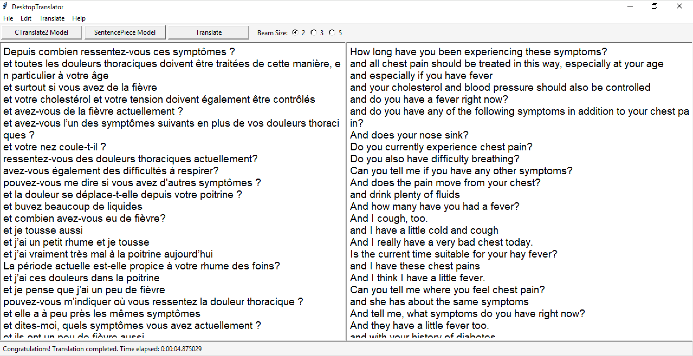

# DesktopTranslator
Local cross-platform machine translation GUI, based on [CTranslate2](https://github.com/OpenNMT/CTranslate2)


<kbd> 


## Download Windows Installer

You can either download a ready-made Windows executable installer for DesktopTranslator, or build an installer yourself.  
[](https://opennmt-gui.s3.us-west-2.amazonaws.com/DesktopTranslator.exe)

    


## Translation Models

Currently, DesktopTranslator supports CTranslate2 models, and SentencePiece subwording models (you need both). If you have a model for OpenNMT-py, OpenNMT-tf, or FairSeq, you can convert it to a CTranslate2 format.

### French-to-English Generic Model

If you would like to try out the app and you do not have a model, you can download my [French-to-English generic model here](https://pretrained-nmt-models.s3.us-west-2.amazonaws.com/CTranslate2/fren/fren.zip). 
1. Unzip the `fren.zip` archive of the French-to-English generic model you just downloaded. It has two folders, `ct2_model` for the CTranslate2 model and `sp_model` for the SentencePiece subwording models of French (source) and English (target).
2. In DesktopTranslator, click the <kbd>CTranslate2 Model</kbd> button, and select the `ct2_model` folder.
3. Click the <kbd>SentencePiece Model</kbd> button, navigate to the `sp_model` folder, and select `fr.model`.
4. The default <kbd>Beam Size</kbd> is 3. You can increase it to 5, which can be slower, but sometimes results in better translation quality.
5. In the left input text-area, type some text in French or use the <kbd>File</kbd> menu \> <kbd>Open...</kbd> to open a *.txt file.
6. Click the <kbd>Translate</kbd> button.

### M2M-100 Multilingual Model

Currently, DesktopTranslator supports M2M-100 multilingual models ([Fan et al., 2020](https://arxiv.org/abs/2010.11125)). With an M2M-100 model, you can translate between 100 languages.
    
<kbd> 

To use M2M-100 models in DesktopTranslator, please follow these steps:
1. Download one the CTranslate2 version of the M2M-100 models:
    a. [M2M-100 418M-parameter model](https://pretrained-nmt-models.s3.us-west-2.amazonaws.com/CTranslate2/m2m100/m2m100_ct2_418m.zip); smaller and faster, but sometimes less accurate; or
    b. [M2M-100 1.2B-parameter model](https://pretrained-nmt-models.s3.us-west-2.amazonaws.com/CTranslate2/m2m100/m2m100_ct2_12b.zip); bigger and somehow slower, but sometimes more accurate.
2. Extract the *.zip arhieve of the model you downloaded.
3. In DesktopTranslator, click the <kbd>CTranslate2 Model</kbd> button, and select the `m2m100_418m` or `m2m100_12b` folder.
4. Click the <kbd>SentencePiece Model</kbd> button, and from the same model folder, select `sentencepiece.model`.
5. **Important:** From the <kbd>M2M-100</kbd> dropdown list, select the target language to which you want to translate. This step is different between M2M-100 and some other models. M2M-100 models require a language code prefix. For other models that do not require this, keep the "None" option.
6. The default <kbd>Beam Size</kbd> is 3. You can increase it to 5, which can be slower, but sometimes results in better translation quality.
7. In the left input text-area, type some text in any language or your choice or use the <kbd>File</kbd> menu \> <kbd>Open...</kbd> to open a *.txt file.
8. Click the <kbd>Translate</kbd> button.

## Build Windows Installer

If you want to adjust the code and then build an installer yourself, you can follow these steps:

1. Install PyInstaller:
```
pip3 install pyinstaller
```

2. To use PyInstaller, specify the Python file name and the argument -w to hide the console window:
```
pyinstaller -y -w "translator.py"
```
If you would like to add an extra folder, e.g. "utils", the command will be:
```
pyinstaller -y -w --add-data="utils/*;utils/" "translator.py"
```
3. Try the `*.exe` file under "dist\translator" to make sure it works. It might complain about the Pmw library. The solution is either remove the Balloon lines, or add [this file](https://gist.github.com/ymoslem/c4b0cd287c7d5f2b7279dfce354d389b) to the same folder as the `translate.py` and run the aforementioned PyInstaller command again.
4. Compress the contents of the “dist” directory created by PyInstaller into a *.zip archive. For example, you can find a folder called "translator"; give it the name you like, e.g. "DesktopTranslator", and add it to a *.zip archive.
5. Download and install [NSIS](https://nsis.sourceforge.io/Download).
6. Launch NSIS, click **Installer based on a .ZIP file**, and then click **Open** to locate the **\*.zip** archive you have just created.
7. If you want to make the files installed (extracted) to the “Program Files” of the target user, in the **Default Folder** enter `$PROGRAMFILES`
8. If you want to add a shortcut to the internal *.exe file on the Desktop after installation, you can add something like this to the file “Modern.nsh” located at: "C:\Program Files\NSIS\Contrib\zip2exe\". Depending on your OS, the path could be at “Program Files (x86)”. Note that the exe path should be consistent with the path you selected under NSIS’s “Default Folder” drop-down menu, the folder name, and the exe file name.
```
Section "Desktop Shortcut" SectionX
    SetShellVarContext current
    CreateShortCut "$DESKTOP\DesktopTranslator.lnk" "$PROGRAMFILES\DesktopTranslator\translator.exe"
SectionEnd
```
If you get a permission error while try to save the edited version of “Modern.nsh”, right-click Notepad, and select "Run as administrator". Then, copy the file content into a new file, and save it to the original location.
9. Finally, click the NSIS **Generate** button, which will create the ***.exe** installer that can be shipped to other Windows machines, without the need to install any extra requirements.
10. After installation, if you applied step \#8, you should find an icon on the Desktop. To uninstall, you can simple remove the app forlder from "Program Files". For more NSIS options, check this [example](https://nsis.sourceforge.io/A_simple_installer_with_start_menu_shortcut_and_uninstaller).
